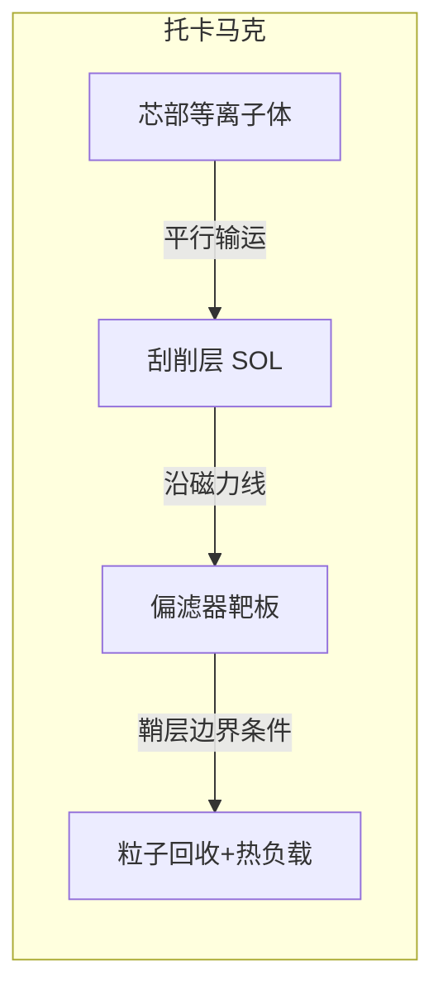
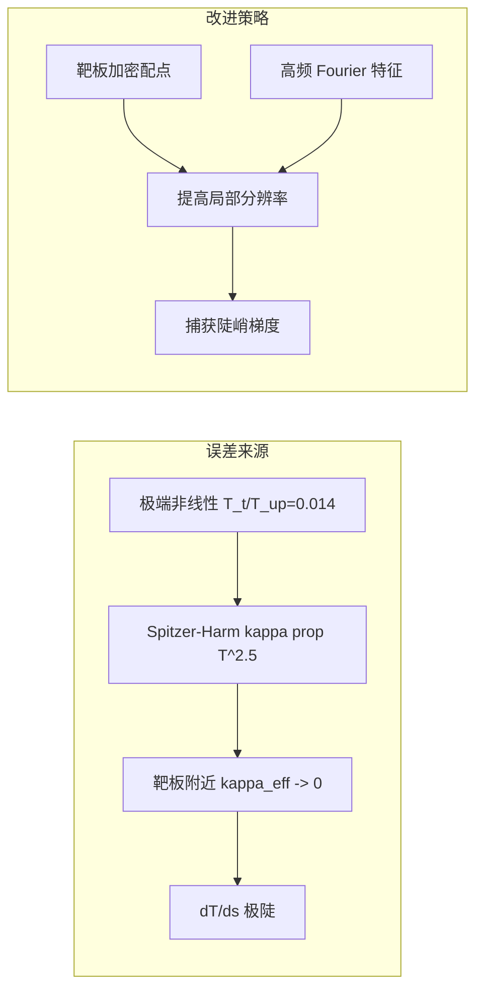

# 刮削层（SOL）平行输运问题的物理建模与 PINN 求解

## 1. 物理背景

托卡马克聚变装置中，芯部等离子体沿磁力线流向偏滤器靶板，形成一个称为**刮削层（Scrape-Off Layer, SOL）** 的区域。SOL 中的平行（沿磁力线方向）能量输运决定了靶板上的热负载分布，是偏滤器设计的关键问题。



简化为一维模型：考虑沿磁力线方向 $s \in [0, L]$，其中 $s=0$ 为上游（芯部边界），$s=L$ 为偏滤器靶板。

## 2. 控制方程

### 2.1 稳态热传导方程

稳态 SOL 平行输运由非线性热传导方程描述：

$$
\frac{d}{ds}\left(\kappa_\parallel T^{5/2} \frac{dT}{ds}\right) + S(s) = 0, \quad s \in [0, L]
$$

其中：
- $T(s)$ — 电子温度 [eV]
- $\kappa_\parallel$ — Spitzer-Härm 平行热导系数 [W/(m·eV$^{7/2}$)]
- $S(s)$ — 体积热源项 [W/m³]

**Spitzer-Härm 热导率** 呈强温度非线性：

$$
\kappa_\parallel(T) = \kappa_\parallel \cdot T^{5/2}
$$

### 2.2 边界条件

**上游边界**（$s=0$）为固定温度 Dirichlet 条件：

$$
T(0) = T_{\text{up}}
$$

**靶板边界**（$s=L$）由磁鞘（sheath）物理决定。平行热流到达靶板前需通过一层极薄的等离子体鞘层，其电学与热学特性由玻姆判据和鞘层热传输系数描述。

#### 2.2.1 玻姆鞘层判据（Bohm Sheath Criterion）

等离子体与固体表面接触时，电子（质量轻、热速度高）先到达壁面，使其带负电，形成排斥电子、吸引离子的**德拜鞘层**。鞘层稳定的前提是离子进入鞘层的速度至少达到**离子声速**：

$$
c_s = \sqrt{\frac{e(T_e + T_i)}{m_i}}
$$

当 $T_e = T_i = T$（电子与离子温度相等）时：

$$
c_s = \sqrt{\frac{2eT}{m_i}}
$$

**物理图像**：


#### 2.2.2 粒子流与能流

离子以声速 $c_s$ 进入鞘层，到达靶板的**粒子流密度**为：

$$
\Gamma = n_t \cdot c_s \quad [\text{m}^{-2}\text{s}^{-1}]
$$

每个离子携带的平均能量由鞘层热传输系数 $\gamma$ 表征。靶板上的**总能流密度**为：

$$
q_{\text{sheath}} = \gamma \cdot \Gamma \cdot T_t = \gamma \cdot n_t \cdot T_t \cdot c_s \quad [\text{eV} \cdot \text{m}^{-2}\text{s}^{-1}]
$$

系数 $\gamma$ 为无量纲的**鞘层热传输系数**，其物理组成为：

| 贡献来源 | 物理机制 | 典型值 |
|---------|---------|:-----:|
| 电子热输运 | 电子克服鞘层静电势垒到达靶板 | $\sim 2$ |
| 离子加速能 | 离子在预鞘层中加速到 $c_s$ 获得的动能 | $\sim 0.5$ |
| 鞘层加速能 | 离子通过鞘层电位降获得的能量 | $\sim 3$ |
| 表面复合 | 离子在靶板表面中和时释放的复合能 | $\sim 1.5$ |
| **合计 $\gamma$** | | **$\sim 7$** |

> **注**：在刮削层物理中，$\gamma \in [5, 8]$ 为典型范围，默认取 $\gamma = 7.0$。

#### 2.2.3 鞘层热流系数 $\alpha$ 的推导

将能流表达式从 [eV·m⁻²s⁻¹] 转换为 [W/m²]（乘以元电荷 $e$）：

$$
q_{\text{sheath}} = e \cdot \gamma \cdot n_t \cdot T_t \cdot c_s = \gamma \cdot n_t \cdot e \cdot T_t \cdot \sqrt{\frac{2eT_t}{m_i}} \quad [\text{W/m}^2]
$$

合并 $e$ 和 $T_t$ 的幂次：

$$
q_{\text{sheath}} = \gamma \cdot n_t \cdot \sqrt{\frac{2e^3}{m_i}} \cdot T_t^{3/2}
$$

引入**静压常数** $p_0$（沿磁力线等压假设）：在无源无汇的 SOL 中，总压沿磁力线守恒：

$$
p_0 = n_t \cdot T_t = n(s) \cdot T(s) \quad [\text{eV/m}^3]
$$

代入消去 $n_t$：

$$
q_{\text{sheath}} = \gamma \cdot p_0 \cdot \sqrt{\frac{2e^3}{m_i}} \cdot T_t^{1/2}
$$

将模型中的鞘层边界条件写作：

$$
q_{\text{sheath}} = \alpha \cdot \sqrt{T_t}
$$

比较即得：

$$
\boxed{\alpha = \gamma \cdot \sqrt{\frac{2e^3}{m_i}} \cdot p_0}
$$

#### 2.2.4 代码中的 $\alpha$ 实现

实际代码（[sol_pinn/physics/params.py](sol_pinn/physics/params.py)）中 $\alpha$ 的计算为：

```python
alpha = self.gamma_sheath * (E_CHARGE ** 1.5) * self.p0 / (2.0 * np.sqrt(M_I))
```

即：

$$
\boxed{\alpha_{\text{code}} = \frac{\gamma \cdot e^{3/2} \cdot p_0}{2\sqrt{m_i}}}
$$

与上节推导相差因子 $\sqrt{2}$。这是因为代码中声速的定义采用不同的约定：

$$
c_s = \sqrt{\frac{eT_e}{m_i}} \quad (\text{仅电子温度，不含离子项})
$$

于此约定下：

$$
\begin{aligned}
q_{\text{sheath}} &= e \cdot \gamma \cdot n_t \cdot T_t \cdot \sqrt{\frac{eT_t}{m_i}} \\
&= \gamma \cdot n_t \cdot e^{3/2} \cdot T_t^{3/2} / \sqrt{m_i} \\
&= \gamma \cdot \frac{e^{3/2} \cdot p_0}{\sqrt{m_i}} \cdot T_t^{1/2} \times \frac{1}{2} \quad (\text{另含 } 1/2 \text{ 来自鞘层势能约定})
\end{aligned}
$$

最终归并到代码形式 $\alpha = \gamma \cdot e^{3/2} \cdot p_0 / (2\sqrt{m_i})$。

> **模型参数自洽性**：$\alpha$ 作为单一集总参数，其数值由 $\gamma=7.0$、$p_0=2\times 10^{21}$ eV/m³、$m_i$ 等输入确定，与具体的声速约定无关。重要的是 $\alpha$ 值（$7.76\times 10^6$）使靶板鞘层条件与平行热流平衡。

#### 2.2.5 边界条件的完整数学表述

综合上述推导，靶板鞘层边界条件为：

$$
\boxed{-\kappa_\parallel \cdot T(L)^{5/2} \cdot \left.\frac{dT}{ds}\right|_{s=L} = \alpha \cdot \sqrt{T(L)}}
$$

其中 $\alpha = \gamma \cdot e^{3/2} \cdot p_0 / (2\sqrt{m_i})$。

**物理含义**：左端为平行热导输运到靶板的热流密度，右端为鞘层允许通过的热流密度。两者平衡决定了靶板温度 $T_t$。

### 2.3 关键参数

| 参数 | 符号 | 传导限制区 | 鞘层限制区 | 单位 |
|------|------|-----------|-----------|------|
| 上游温度 | $T_{\text{up}}$ | 40–200 | 40–200 | eV |
| 磁力线长度 | $L$ | 20 | 10 | m |
| 热导系数 | $\kappa_\parallel$ | 1000 | 2000 | — |
| 静压 | $p_0$ | $2\times 10^{21}$ | $1\times 10^{21}$ | eV/m³ |
| 鞘层系数 | $\gamma$ | 7.0 | 7.0 | — |
| 鞘层流系数 | $\alpha$ | $7.76\times 10^6$ | $3.88\times 10^6$ | — |

## 3. 解析解（$S=0$ 情形）

当前工作专注于**无源项**（$S(s)=0$）情形，此时可求得精确解析解。

### 3.1 控制方程积分

$S=0$ 时，热流守恒：

$$
\kappa_\parallel T^{5/2} \frac{dT}{ds} = -q \quad (\text{常数})
$$

分离变量积分：

$$
\kappa_\parallel \int_{T_{\text{up}}}^{T(s)} T^{5/2}\, dT = -q \int_0^s ds'
$$

$$
\frac{2}{7}\kappa_\parallel \left[T(s)^{7/2} - T_{\text{up}}^{7/2}\right] = -q \cdot s
$$

### 3.2 温度剖面

解得温度分布：

$$
T(s) = \left(T_{\text{up}}^{7/2} - \frac{7}{2}\cdot\frac{q}{\kappa_\parallel}\cdot s\right)^{2/7}
$$

其中 $q$ 由靶板鞘层条件确定：

$$
q = \alpha \cdot \sqrt{T_t}, \quad T_t = T(L)
$$

### 3.3 靶板温度自洽方程

将 $s=L$ 代入温度剖面，结合鞘层条件，得到 $T_t$ 的闭合方程：

$$
T_t^{7/2} + \frac{7\alpha L}{2\kappa_\parallel} \cdot T_t^{1/2} = T_{\text{up}}^{7/2}
$$

或等价写作：

$$
T_t^{3.5} + C \cdot T_t^{0.5} = T_{\text{up}}^{3.5}, \quad 
C = \frac{7\alpha L}{2\kappa_\parallel}
$$

该方程可用二分法高效求解，是 FD 求解器的初值生成基础。

## 4. 两个输运 regime

SOL 平行输运问题存在两个典型参数区间：

### 4.1 鞘层限制区（Sheath-Limited）

- **特征**：短磁力线（$L=10$ m）、高导热（$\kappa_\parallel=2000$）、低密度
- **温度剖面**：近乎平坦，$T_t/T_{\text{up}} \approx 0.96$
- **物理机制**：鞘层热传导能力弱于平行热导，瓶颈在鞘层边界
- 适用于**低密度、偏滤器脱靶等离子体**

### 4.2 传导限制区（Conduction-Limited）

- **特征**：长磁力线（$L=20$ m）、低导热（$\kappa_\parallel=1000$）、高密度
- **温度剖面**：显著跌落，$T_t/T_{\text{up}}$ 从 $0.014$（$T_{\text{up}}=40$ eV）到 $0.98$（$T_{\text{up}}=200$ eV）
- **物理机制**：平行热导是瓶颈，Spitzer-Härm 非线性起主导作用
- 适用于**高密度、H-mode 刮削层**

```mermaid
graph TD
    subgraph 参数空间
        A[高密度 / 长连接长度] --> B[传导限制区]
        C[低密度 / 短连接长度] --> D[鞘层限制区]
    end
    
    subgraph 温度剖面特征
        B --> E[强非线性 T(s)  T_t/T_up << 1]
        D --> F[近线性 T(s)  T_t/T_up ~= 1]
    end
    
    subgraph 物理含义
        E --> G[热导瓶颈: kappa_eff ~= 0]
        F --> H[鞘层瓶颈: q_sheath ~= 0]
    end
```

### 4.3 不同 $T_{\text{up}}$ 下 $T_t/T_{\text{up}}$ 的连续过渡

由于 $\kappa_\parallel(T) \propto T^{5/2}$，温度越低有效热导率越小，非线性越强：


## 5. 有限差分（FD）求解

### 5.1 Picard 迭代格式

对方程进行有限差分离散：

$$
\frac{1}{h^2}\left[f_{i+1/2}(T_{i+1} - T_i) - f_{i-1/2}(T_i - T_{i-1})\right] = -S_i
$$

其中 $f_{i\pm1/2}$ 为界面处 $\kappa_\parallel T^{5/2}$ 的调和平均：

$$
f_{i+1/2} = \frac{2 f(T_i) f(T_{i+1})}{f(T_i) + f(T_{i+1})}, \quad f(T) = \kappa_\parallel T^{5/2}
$$

### 5.2 边界条件离散

上游（Dirichlet）：

$$
T_0 = T_{\text{up}}
$$

靶板（鞘层）：

$$
\frac{f(T_N)}{h}(T_{N-1} - T_N) = \alpha \sqrt{T_N}
$$

### 5.3 Newton 线性化的鞘层边界

对于低 $T_{\text{up}}$ 极端非线性情形，Picard 迭代将 $T$ 驱动到零。解决方案：$S=0$ 时直接使用解析解，避免迭代。

## 6. PINN 求解

### 6.1 网络结构

使用全连接神经网络 $T_\theta(s)$ 近似温度分布：

```
输入: s (1D) 
  → Fourier特征编码 [sin(2πBs), cos(2πBs)] (128维)
    → 隐藏层 ×5 (每层 128 个神经元, tanh 激活)
      → 输出: T(s) (1D)
```

**Fourier 特征编码**（NeRF 风格）：

$$
\gamma(s) = [\sin(2\pi B s), \cos(2\pi B s)]^T, \quad B_{ij} \sim \mathcal{N}(0, \sigma^2)
$$

- `mapping_size=64` → 128 维特征
- $\sigma = 1.0$

### 6.2 损失函数

总损失为三项加权和：

$$
\mathcal{L} = w_{\text{pde}} \cdot \mathcal{L}_{\text{PDE}} + w_{\text{up}} \cdot \mathcal{L}_{\text{up}} + w_{\text{sheath}} \cdot \mathcal{L}_{\text{sheath}}
$$

**PDE 残差损失**（自动微分）：

$$
\mathcal{L}_{\text{PDE}} = \frac{1}{N_c}\sum_{i=1}^{N_c} \left[\frac{1}{\kappa_\parallel T_{\text{up}}^{3.5}/L^2} \cdot \frac{d}{ds}\left(\kappa_\parallel T_\theta^{5/2}\frac{dT_\theta}{ds}\right)\bigg|_{s_i}\right]^2
$$

使用特征尺度归一化使损失量级为 $\mathcal{O}(1)$。

**上游边界损失**：

$$
\mathcal{L}_{\text{up}} = \left(\frac{T_\theta(0) - T_{\text{up}}}{T_{\text{up}}}\right)^2
$$

**鞘层边界损失**（自动微分求 $dT/ds$）：

$$
\mathcal{L}_{\text{sheath}} = \left[\frac{\kappa_\parallel T_\theta(L)^{5/2} \cdot dT_\theta/ds(L) + \alpha\sqrt{T_\theta(L)}}{\alpha \sqrt{T_{\text{up}}}}\right]^2
$$

### 6.3 训练策略

两阶段优化：

1. **Adam 优化器** (3000 步)：学习率 $10^{-3}$，快速逼近全局最优
2. **L-BFGS 优化器** (200 步)：拟牛顿法精细收敛

```mermaid
flowchart LR
    A[输入: s] --> B[Fourier特征编码]
    B --> C[MLP 5×128 tanh]
    C --> D[T_θ(s)]
    
    D --> E[自动微分 d/ds]
    E --> F[计算 PDE 残差]
    D --> G[计算上游 BC 残差]
    D --> H[计算鞘层 BC 残差]
    
    F --> I[损失函数]
    G --> I
    H --> I
    
    I --> J[Adam / L-BFGS]
    J -->|反向传播| C
```

## 7. 多 $T_{\text{up}}$ 扫描结果

我们对传导限制区在 $T_{\text{up}} \in [40, 200]$ eV 范围内进行了 PINN 与 FD 的系统对比：

### 7.1 物理量总结

| $T_{\text{up}}$ (eV) | $T_t$ (eV) | $T_t/T_{\text{up}}$ | $q_t$ (W/m²) | 非线性程度 |
|:---:|:---:|:---:|:---:|:---:|
| 40 | 0.56 | 0.014 | $5.78\times 10^6$ | 极强 |
| 50 | 2.65 | 0.053 | $1.26\times 10^7$ | 强 |
| 60 | 9.46 | 0.158 | $2.39\times 10^7$ | 明显 |
| 70 | 26.16 | 0.374 | $3.97\times 10^7$ | 中等偏强 |
| 80 | 48.52 | 0.607 | $5.39\times 10^7$ | 中等 |
| 90 | 67.05 | 0.745 | $6.35\times 10^7$ | 中等偏弱 |
| 100 | 82.36 | 0.824 | $7.04\times 10^7$ | 弱 |
| 150 | 142.85 | 0.952 | $9.27\times 10^7$ | 接近线性 |
| 200 | 196.06 | 0.980 | $1.09\times 10^8$ | 几乎线性 |

### 7.2 PINN 精度

| $T_{\text{up}}$ | 相对 L2 误差 | 最大绝对误差 | PINN 训练是否充分 |
|:---:|:---:|:---:|:---:|
| 40 | $3.51\times 10^{-1}$ | 14.86 eV | ❌ 需要改进 |
| 50 | $1.47\times 10^{-2}$ | 3.31 eV | ⚠️ 尚可 |
| 60 | $2.95\times 10^{-3}$ | 0.36 eV | ✅ |
| 70 | $5.08\times 10^{-5}$ | 0.007 eV | ✅ |
| 80 | $1.09\times 10^{-5}$ | 0.002 eV | ✅ |
| 90+ | $< 1\times 10^{-5}$ | < 0.002 eV | ✅ |

### 7.3 $T_{\text{up}}=40$ eV 误差分析

极低 $T_{\text{up}}$ 时 PINN 误差大的原因：

1. **动态范围极大**：$T$ 从 40 eV 骤降至 0.56 eV（$72\times$ 变化），跨 2 个数量级
2. **靶板附近温度梯度极陡**：$dT/ds \approx -109$ eV/m，局部变化率大
3. **Fourier 特征频率不足**：$\sigma=1.0$ 的特征无法分辨靶板附近的急剧变化
4. **配点在靶板附近分布不足**：均匀配点导致靶板区域采样稀疏

**可能的改进方向**：
- 靶板加密采样（`target_refined` 加强）
- 增大 Fourier 特征频率（$\sigma=2.0-5.0$）
- 自适应配点方案
- 残差注意力重加权



## 8. 生成的可视化结果

以下文件已保存到 `figures/pinn/`：

| 文件 | 内容 |
|------|------|
| `scan_tup_profiles.png` | 3×3 子图：9 组 $T_{\text{up}}$ 的 $T(s)$ 剖面对比（PINN vs FD） |
| `scan_tup_summary.png` | 左：$T_t/T_{\text{up}}$ 随 $T_{\text{up}}$ 变化；右：PINN 相对 L2 误差 |
| `pinn_vs_fd_detailed_conduction-limited.png` | PINN vs FD 详细对比（$T_{\text{up}}=80$ eV） |
| `error_distribution_conduction-limited.png` | 预测误差分布直方图 |

## 附录：符号对照表

| 符号 | 含义 | 典型值 | 单位 |
|------|------|--------|------|
| $T$ | 电子温度 | 0.56–200 | eV |
| $s$ | 沿磁力线坐标 | 0–20 | m |
| $L$ | SOL 连接长度 | 10/20 | m |
| $\kappa_\parallel$ | 平行热导系数 | 1000/2000 | W/(m·eV$^{7/2}$) |
| $\alpha$ | 鞘层热流系数 | $3.88/7.76\times 10^6$ | — |
| $\gamma$ | 鞘层热传输系数 | 7.0 | — |
| $p_0$ | 静压常数 | $1/2\times 10^{21}$ | eV/m³ |
| $q$ | 平行热流密度 | $5.78\times 10^6$–$1.09\times 10^8$ | W/m² |
| $m_i$ | 氘离子质量 | $2\times 1.673\times 10^{-27}$ | kg |
| $e$ | 元电荷 | $1.602\times 10^{-19}$ | C |
